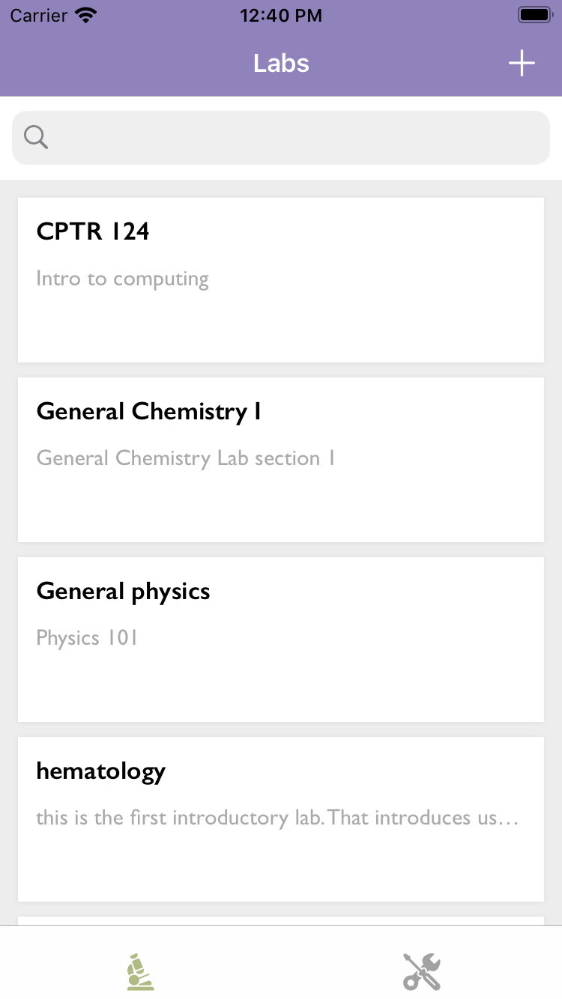

An iOS application that helps scientific professionals manage laboratory sections and equipment more collaboratively.
## Publications 
There are 2 publications about the projects: [Project Proposal] and [Project Poster] ✍️.

## Technologies ⚙️
[Xcode], [Swift], [MVVM], [Google Firebase SDKs].

## Main features:

***1. Users*** 👥

Users can sign up and log in using their emails ✉️.

There are two types of users, **normal users**👤, and **moderators**👩‍💼. And they have different roles.
should have different roles, as described in this [diagram](#use-case-diagram).
1. Both moderators and normal users can sign up and log in 🔑.
2. Normal users can manage their laboratory sections, meaning viewing, creating, and editing the sections that they are in charge
of.
3. Moderators can manage laboratory sections of their departmental members.
4. Normal users can view 🔎 equipment that is available in their department.
5. Moderators can manage the equipment, meaning creating, viewing, and edit equipment of the department.

 
 
 
 
 
 

&nbsp;&nbsp;&nbsp;&nbsp;&nbsp;&nbsp;***2.Lab sections*** 📃

&nbsp;&nbsp;&nbsp;&nbsp;&nbsp;&nbsp;Users can create, view, edit, and delete lab sections.  
&nbsp;&nbsp;&nbsp;&nbsp;&nbsp;&nbsp;1. ➕ Create a new lab section with helpful information such as name, description, and the list of equipment.  
&nbsp;&nbsp;&nbsp;&nbsp;&nbsp;&nbsp;2. View and search by keywords 🔎 lab sections that the users are in charge of.   
&nbsp;&nbsp;&nbsp;&nbsp;&nbsp;&nbsp;3. Edit the name, description, or the list of equipment by changing the quantity of the equipment being used.   
&nbsp;&nbsp;&nbsp;&nbsp;&nbsp;&nbsp;4. Delete ❌ the sections that are no longer needed.  

 
 
 
 
 
 
 
 
 

***3.Equipment*** ⚒️

Moderators 👩‍💼 can create, view, edit, and delete equipment in their department.
Normal users can view equipment and request an edit from the department.
1. View and search by keywords 🔎 equipment that is available at the department.
2. Equipment info includes information such as name, description, location 📌, a preview picture 🖼️, and **a list of users** 👥.
3. The list of users  is an important piece of information and can be used to collaborate and share the available equipment in a better manner ✅.

 
 
 
 
 
 
 

## Screenshots

  
  
  
  
  
  

 

## Use case diagram

.

## Contributing and License
Contributions are more than welcome.

Laboratory is released under the Apache License 2.0. [See LICENSE](https://github.com/2-letters/Laboratory.iOS/blob/master/LICENSE) for details.

[Project Proposal]: https://drive.google.com/file/d/1MCzDw_U9_WsVgIXtvqrS8UXya_c9Lw3B/view?usp=sharing
[Project Poster]: https://drive.google.com/file/d/1XkFxiIdr9Jf-WzJl3VLbwwOGRJkKqm9e/view?usp=sharing
[Xcode]: https://developer.apple.com/xcode
[Swift]: https://developer.apple.com/swift
[MVVM]: https://cocoacasts.com/model-view-viewmodel-in-swift
[Google Firebase SDKs]: https://firebase.google.com/docs/storage/ios/start
