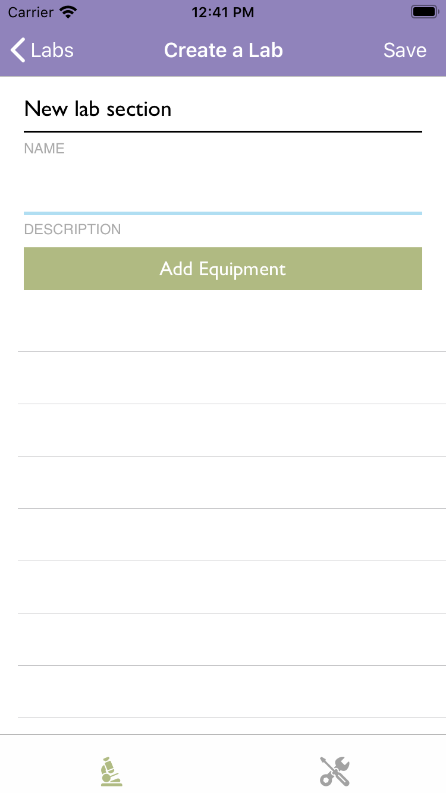

An iOS application that helps scientific professionals manage laboratory sections and equipment more collaboratively.

 
<h2>Publications</h2>
More information about the projects are present in the [1] and [project poster].

<h2>Main features:</h2>

***1. User log-in***

4 options to choose a place:
- Choose a country: Choose countries by continent, then select cities.
- Search for a city: From the list of cities, search for a country/city.
- Saved places: Select cities from the places that are saved.
- Nearby: Choose nearby places from the user's current location.

For each city, there will be information about the places to visit, events to attend, and food to try.

The app also helps users to have great financial preparations by suggesting the budget needed for the trip planned.

 
 
 

<ul>
    <li>Add Equipment including pictures and locations.</li>
    <li>Add Lab sections including details and equipment.</li>
    <li>Use the equipment in a collaborative manner by sharing them and letting others know that you are.</li>
</ul>

<h2>Technologies</h2>

Xcode, Swift, MVVM, Google Firebase SDKs.

<h2>Screenshots</h2>

  
  
  
  

[1]: http://www.reddit.com
[project poster]: http://www.reddit.com
