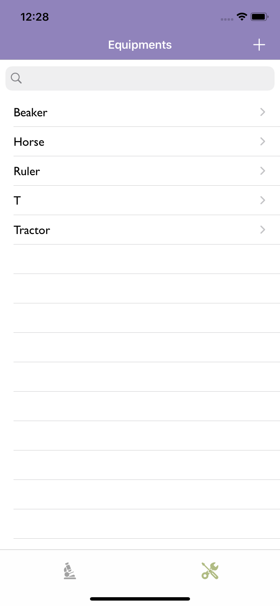

# Laboratory.iOS

An iOS application that helps scientific professionals manage laboratory sections and equipment more collaboratively.

Key features:

<ul>
    <li>Add Equipment including pictures and locations.</li>
    <li>Add Lab sections including details and equipment.</li>
    <li>Use the equipment in a collaborative manner by sharing them and letting others know that you are.</li>
</ul>

TO BE UPDATED..

<h2>Screenshots</h2>

  
  
  
  

